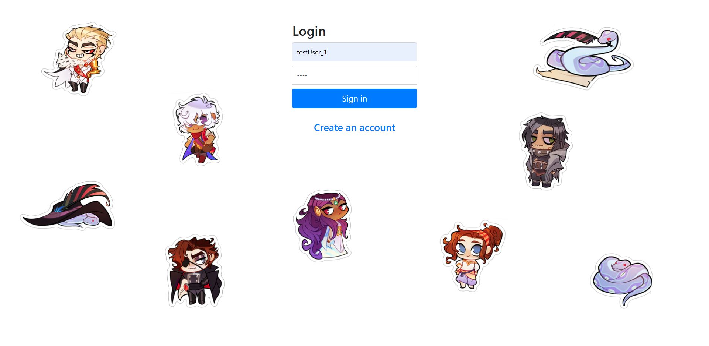
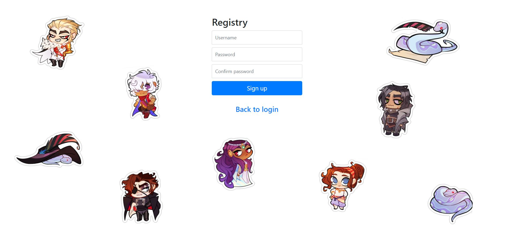
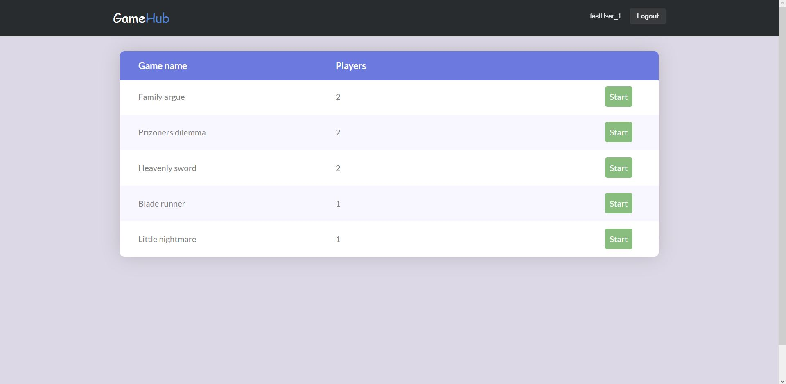
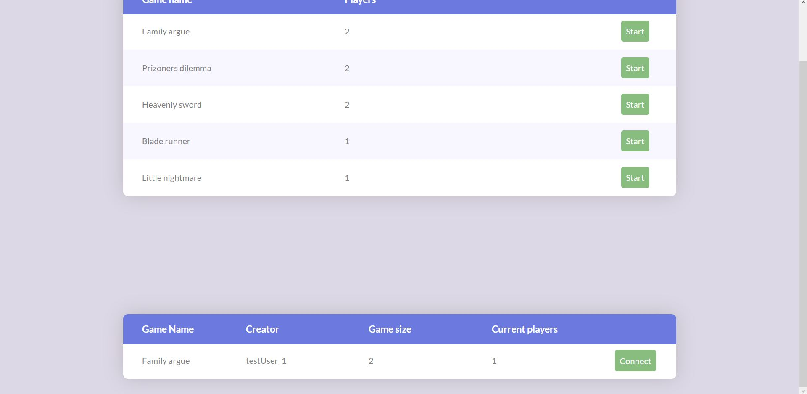
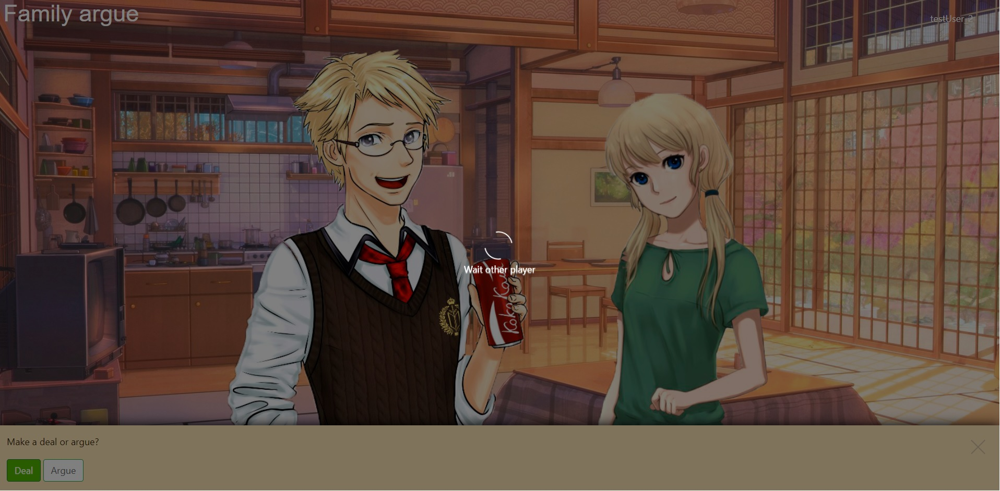
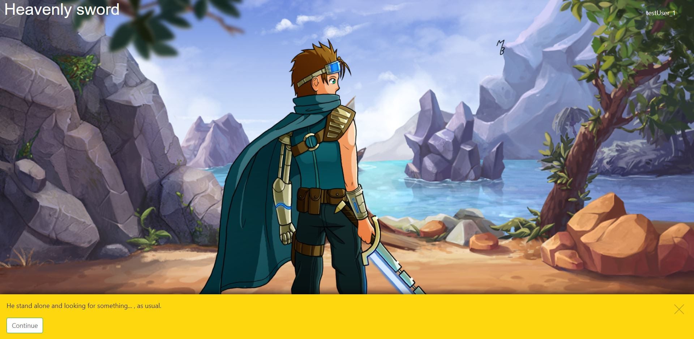
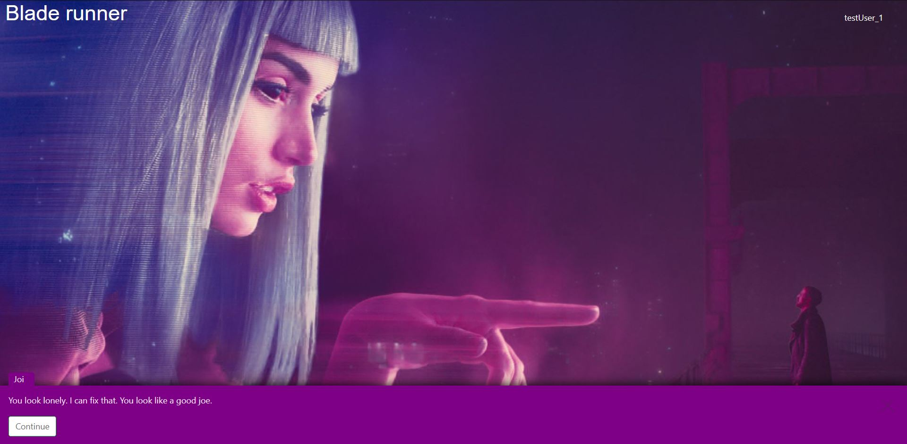
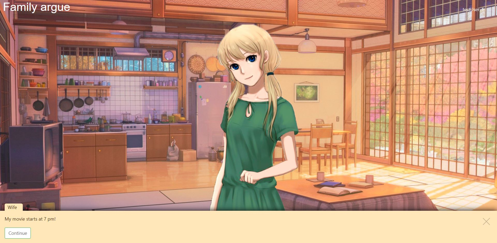
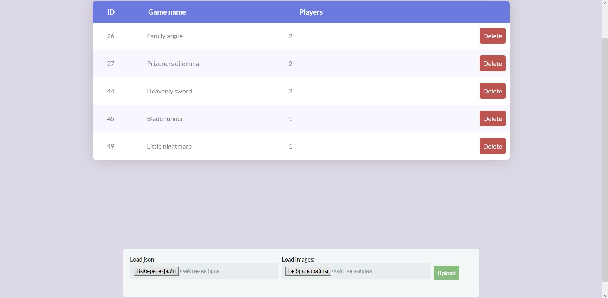

# GameHub

This study project is server-side application presents service for playing and creating visual nowels. Supports multiplayer for 2 players (for now).

## How is this looks like?

User opens main page and passes authorization.



Or he can sign up, if he haven't account.



Than he sees main menu and can choose the game.



If this game supports 2 players, at the same time other player can connect to his game.



At the game, players should make their choices and wait other players. Result of each player depends on the choice of another player.



When players end game, they return to the main menu.

## Game examples

These games were created in GameHub






## How to create games?

Each game consist of two parts: resources or images and rules. Images are backgrounds and sprites. Rules are a document in JSON format. You can find game examples at games/

**!NOTE!** To add your own games you need to be authorized as admin. That means, you should have an account, marked as 'ROLE_ADMIN' at 'role' attribute. GameHub has no ways to create admin account. You have to do it manually. When it is done, you will see admin page: 



## Getting started

To run this app you need:

1. Install Java JDK + JVM
2. Install InteliJ IDEA
3. Install MySQL and current database from script: database/gamehub.sql
4. Create property files at src/main/resources:

   - hibernate.properties
   ```
   driverClassName = com.mysql.cj.jdbc.Driver
   url = // link to database
   username = // login
   password = // password
   ```
   - security.properties
   ```
   round = // number for password encryption to db
   ``` 

## Running the tests

Run tests at test module to see if everythind is done correctly. One of the tests requires already created user!

## Built with

1. Java 9
2. Maven
3. Spring MVC + Spring Security
4. Hibernate
5. JUnit 4
6. Jetty
7. MySQL database

## License

This project is free for use.
